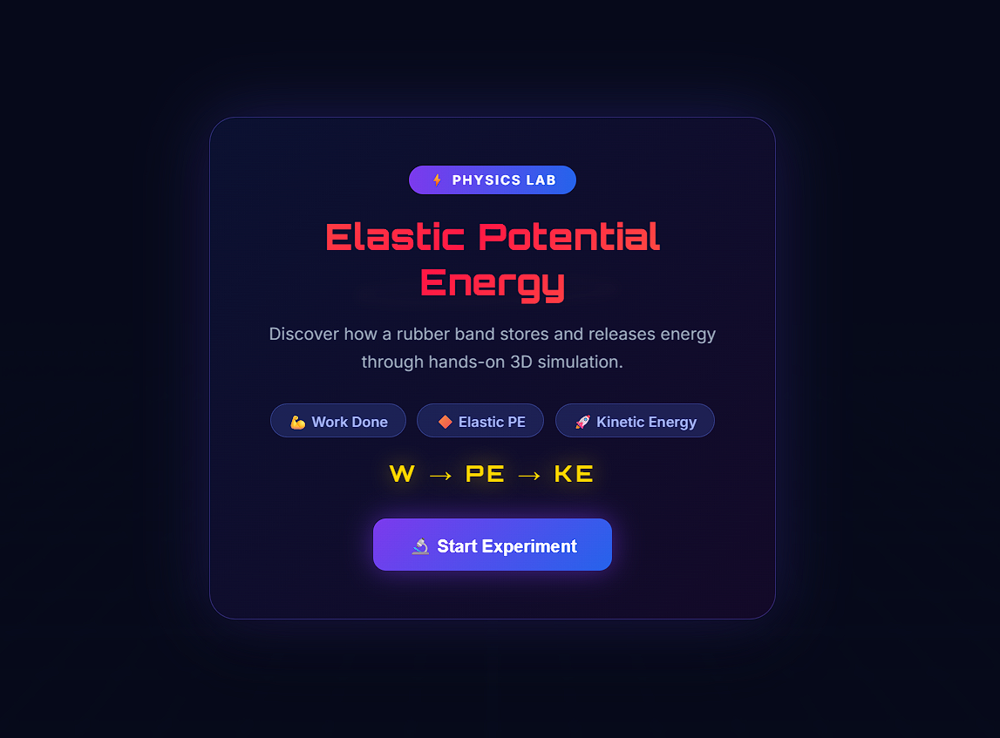

# 🚀 3D Lab Project

## 📌 Overview

The **3D Lab Project** is an interactive web-based application built using **React + Vite**, designed to showcase 3D visuals and user interactions. This project demonstrates modern frontend development practices along with immersive UI experiences.

---

## ✨ Features

* 🎯 Interactive 3D components
* ⚡ Fast performance with Vite
* 🎨 Clean and responsive UI
* 🔄 Real-time updates (HMR - Hot Module Replacement)
* 🧩 Modular and scalable code structure

---

## 🛠️ Tech Stack

* **Frontend:** React
* **Build Tool:** Vite
* **Languages:** JavaScript, HTML, CSS
* *(Optional: Add Three.js if you're using it)*

---

## 📂 Project Structure

```
3D-Lab-Project/
│── public/
│── src/
│── .gitignore
│── package.json
│── vite.config.js
│── README.md
```

---

## ▶️ Getting Started

### 1️⃣ Clone the repository

```
git clone https://github.com/Snigdha-0210/3D-Lab-Project.git
```

### 2️⃣ Navigate to project folder

```
cd 3D-Lab-Project
```

### 3️⃣ Install dependencies

```
npm install
```

### 4️⃣ Run the development server

```
npm run dev
```

---

## 📸 Screenshots

*(Add your project screenshots here)*

Example:

```

```

---

## 📈 Future Improvements

* 🌟 Add more interactive 3D models
* 🎮 Improve user controls and animations

---

## 📬 Contact

* GitHub: https://github.com/Snigdha-0210

---

⭐ If you like this project, don’t forget to give it a star!
